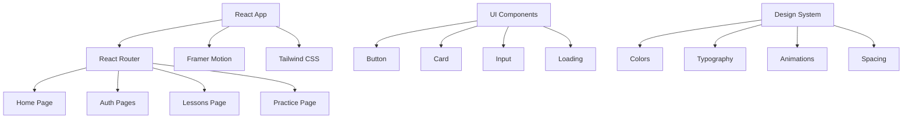
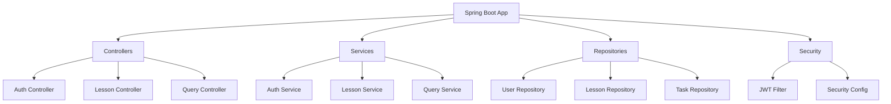

# 📚 Документация Space SQL

Добро пожаловать в документацию проекта Space SQL - интерактивной платформы для изучения SQL с космической тематикой!

## 🗂️ Структура документации

### 🎨 Frontend
- [**📚 Фронтенд**](FRONTEND.md) - Полная документация по React приложению
- [**🧩 Компоненты**](COMPONENTS.md) - Описание всех UI компонентов и их API
- [**🎨 Дизайн-система**](DESIGN_SYSTEM.md) - Космическая дизайн-система, цвета, типографика и стили

### 🔧 Backend & API
- [**📡 API Спецификация**](api/SPECIFICATION.md) - REST API endpoints и схемы данных
- [**🗄️ База данных**](architecture/database.md) - Схема БД и архитектурные решения

## 🚀 Быстрые ссылки

### Для разработчиков
- [Установка и настройка](FRONTEND.md#установка-и-запуск)
- [Создание новых компонентов](COMPONENTS.md#лучшие-практики)
- [Использование дизайн-системы](DESIGN_SYSTEM.md#utility-классы)

### Для дизайнеров
- [Цветовая палитра](DESIGN_SYSTEM.md#цветовая-палитра)
- [Типографика](DESIGN_SYSTEM.md#типографика)
- [Анимации и эффекты](DESIGN_SYSTEM.md#эффекты-и-анимации)

### Для QA
- [Тестирование компонентов](COMPONENTS.md#тестирование-компонентов)
- [Адаптивность](DESIGN_SYSTEM.md#адаптивность)

## 🎯 Архитектура проекта

### Frontend Architecture



### Backend Architecture



## 🛠️ Технологический стек

### Frontend Technologies

| Технология | Версия | Назначение |
|------------|--------|------------|
| **React** | 18.x | Основной фреймворк |
| **React Router** | 6.x | Маршрутизация |
| **Framer Motion** | 10.x | Анимации |
| **Tailwind CSS** | 3.x | Стили |
| **Axios** | 1.x | HTTP клиент |

### Backend Technologies

| Технология | Версия | Назначение |
|------------|--------|------------|
| **Java** | 17+ | Язык программирования |
| **Spring Boot** | 3.x | Основной фреймворк |
| **Spring Security** | 6.x | Безопасность |
| **PostgreSQL** | 13+ | База данных |
| **Liquibase** | 4.x | Миграции БД |

## 🎨 Дизайн-принципы

### 🌌 Космическая тематика
- Темные фоны с градиентами
- Неоновые акценты и свечения
- Анимированные звезды и частицы
- Футуристическая типографика

### 🎭 Анимации
- Плавные переходы между страницами
- Hover эффекты для интерактивности
- Stagger анимации для списков
- Микроанимации для обратной связи

### 📱 Адаптивность
- Mobile-first подход
- Breakpoints для всех устройств
- Гибкие сетки и компоненты
- Оптимизация для касаний

## 🔧 Инструменты разработки

### Рекомендуемые расширения VS Code
```json
{
  "recommendations": [
    "bradlc.vscode-tailwindcss",
    "esbenp.prettier-vscode",
    "ms-vscode.vscode-typescript-next",
    "formulahendry.auto-rename-tag",
    "christian-kohler.path-intellisense"
  ]
}
```

### Настройка Prettier
```json
{
  "semi": true,
  "trailingComma": "es5",
  "singleQuote": true,
  "printWidth": 80,
  "tabWidth": 2
}
```

## 📋 Чек-листы

### ✅ Создание нового компонента
- [ ] Создать файл компонента в правильной папке
- [ ] Использовать TypeScript или PropTypes
- [ ] Добавить анимации с Framer Motion
- [ ] Следовать дизайн-системе
- [ ] Сделать адаптивным
- [ ] Добавить в индексный файл
- [ ] Написать документацию
- [ ] Добавить тесты

### ✅ Создание новой страницы
- [ ] Создать компонент страницы
- [ ] Добавить роут в App.js
- [ ] Настроить защиту (если нужно)
- [ ] Добавить анимации переходов
- [ ] Протестировать на всех устройствах
- [ ] Добавить в навигацию
- [ ] Обновить документацию

## 🐛 Отладка

### Частые проблемы

**Анимации не работают:**
- Проверьте импорт Framer Motion
- Убедитесь в правильности variants
- Проверьте initial/animate props

**Стили не применяются:**
- Проверьте правильность Tailwind классов
- Убедитесь в сборке CSS
- Проверьте конфигурацию Tailwind

**API не отвечает:**
- Проверьте CORS настройки
- Убедитесь в правильности endpoints
- Проверьте аутентификацию

### Полезные команды

```bash
# Проверка линтера
npm run lint

# Форматирование кода
npm run format

# Анализ bundle
npm run analyze

# Проверка типов
npm run type-check
```

## 🤝 Вклад в документацию

Документация - это живой документ, который развивается вместе с проектом. 

### Как улучшить документацию:
1. Найдите неточность или пробел
2. Создайте issue с описанием проблемы
3. Предложите исправление через PR
4. Следуйте стилю существующей документации

### Стиль документации:
- Используйте эмодзи для визуального разделения
- Добавляйте примеры кода
- Создавайте диаграммы для сложных концепций
- Пишите понятно и структурированно

---

<div align="center">
  <p><em>Документация создана с ❤️ для покорения космоса через изучение SQL</em></p>
  
  **[⬆️ Вернуться к началу](#-документация-space-sql)**
</div>