# Документация по базе данных

## Схема базы данных

В проекте используется реляционная база данных PostgreSQL. Ниже представлена интерактивная ERD-диаграмма базы данных.

### Интерактивная ERD-диаграмма

[](https://liambx.com/erd/p/github.com/linskay/space-sql/blob/master/schema.sql)

### Как посмотреть ERD-диаграмму локально

1. Сгенерируйте актуальную схему:
   ```sh
   mvn process-resources
   npx @liam-hq/cli erd build --input schema.sql --format postgres
   ```
2. Запустите локальный сервер в папке dist:
   ```sh
   npx http-server dist/
   ```
3. Откройте [http://localhost:8080](http://localhost:8080) (или другой свободный порт) в браузере.

### Структура папок

- `dist/` — интерактивная ERD-диаграмма (всё, что нужно для просмотра через http-server)
- `schema.sql` — актуальная схема БД (генерируется автоматически)

---

## Детализированная схема данных

Ниже представлена детализированная визуализация структуры базы данных с помощью Mermaid-диаграмм.

### ER-диаграмма сущностей

```mermaid
erDiagram
    USERS ||--o{ USER_PROGRESS : has
    LESSONS ||--o{ TASKS : contains
    TASKS ||--o{ TASK_EXAMPLES : has
    
    USERS {
        bigint id PK
        varchar(255) email
        varchar(255) password
        varchar(255) github_username
        text avatar_url
        integer progress
        boolean enabled
    }
    
    LESSONS {
        bigint id PK
        varchar(255) title
        text description
        varchar(100) topic
        varchar(50) difficulty
        integer order_index
    }
    
    TASKS {
        bigint id PK
        bigint lesson_id FK
        varchar(255) title
        text description
        text schema_definition
        text solution_query
        integer order_index
    }
    
    TASK_EXAMPLES {
        bigint id PK
        bigint task_id FK
        jsonb example_data
    }
    
    USER_PROGRESS {
        bigint id PK
        bigint user_id FK
        bigint task_id FK
        boolean completed
        timestamp completed_at
    }
```



## Основные сущности

### Уроки (lessons)

Хранит информацию об уроках.

| Поле | Тип | Описание |
|------|-----|----------|
| id | BIGINT | Первичный ключ |
| title | VARCHAR(255) | Название урока |
| description | TEXT | Подробное описание |
| topic | VARCHAR(100) | Тема урока |
| difficulty | VARCHAR(50) | Уровень сложности (Легкий/Средний/Сложный) |
| order_index | INTEGER | Порядковый номер урока |

### Задания (tasks)

Содержит задания для уроков.

| Поле | Тип | Описание |
|------|-----|----------|
| id | BIGINT | Первичный ключ |
| lesson_id | BIGINT | Внешний ключ к таблице lessons |
| title | VARCHAR(255) | Название задания |
| description | TEXT | Описание задания |
| schema_definition | TEXT | SQL-скрипт для создания схемы БД задания |
| solution_query | TEXT | Правильный SQL-запрос для задания |
| order_index | INTEGER | Порядковый номер задания |

### Пользователи (users)

Информация о пользователях системы.

| Поле | Тип | Описание |
|------|-----|----------|
| id | BIGINT | Первичный ключ |
| email | VARCHAR(255) | Email пользователя (уникальный) |
| password | VARCHAR(255) | Хеш пароля (BCrypt) |
| github_username | VARCHAR(255) | Имя пользователя GitHub |
| avatar_url | TEXT | URL аватара пользователя |
| progress | INTEGER | Прогресс обучения в процентах |
| enabled | BOOLEAN | Флаг активности аккаунта |

### Примеры данных (task_example_data)

Содержит примеры данных для заданий.

| Поле | Тип | Описание |
|------|-----|----------|
| id | BIGINT | Первичный ключ |
| task_id | BIGINT | Внешний ключ к таблице tasks |
| example_data | JSONB | Пример данных в формате JSON |

## Связи между сущностями


## Миграции

Для управления изменениями в структуре БД используется Liquibase. Файлы миграций находятся в каталоге `src/main/resources/db/changelog/`.

## Примеры запросов

### Получение списка уроков с количеством заданий

```sql
SELECT 
    l.id,
    l.title,
    l.topic,
    l.difficulty,
    COUNT(t.id) AS task_count
FROM 
    lessons l
LEFT JOIN 
    tasks t ON l.id = t.lesson_id
GROUP BY 
    l.id, l.title, l.topic, l.difficulty
ORDER BY 
    l.order_index;
```

### Получение прогресса пользователя по урокам

```sql
SELECT 
    l.id AS lesson_id,
    l.title AS lesson_title,
    COUNT(t.id) AS total_tasks,
    COUNT(up.task_id) AS completed_tasks
FROM 
    lessons l
LEFT JOIN 
    tasks t ON l.id = t.lesson_id
LEFT JOIN 
    user_progress up ON t.id = up.task_id AND up.user_id = :userId AND up.completed = true
GROUP BY 
    l.id, l.title
ORDER BY 
    l.order_index;
```

Полное описание структуры БД также доступно в файле [schema.sql](../../schema.sql).
